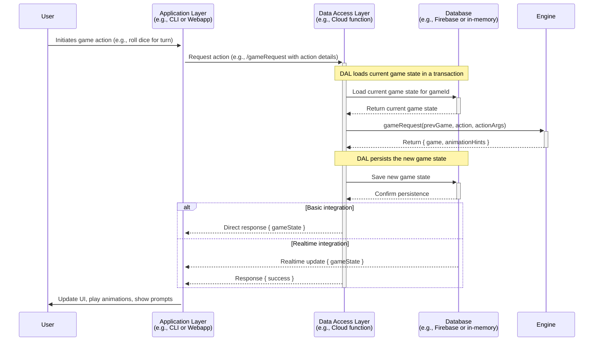

# Technical Overview

Welcome to the Technical Overview of the Engine package. This section provides a high-level summary and direct links into the generated API documentation.

## Data Flow Diagram

The following diagram illustrates the typical sequence of events when a user performs an action in the game:

