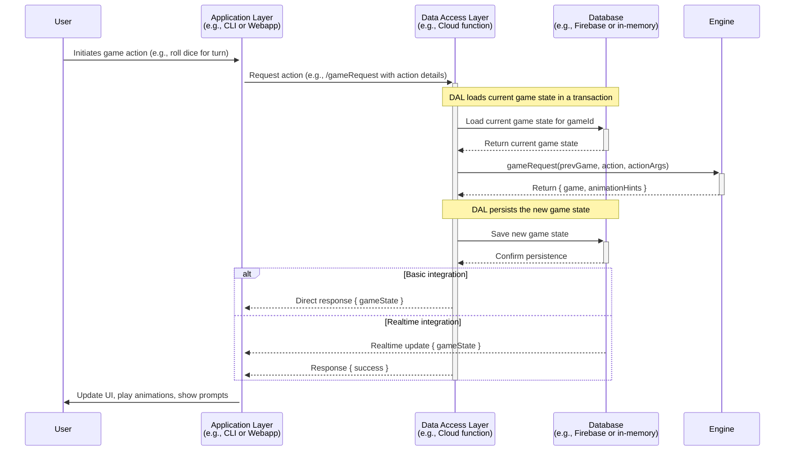
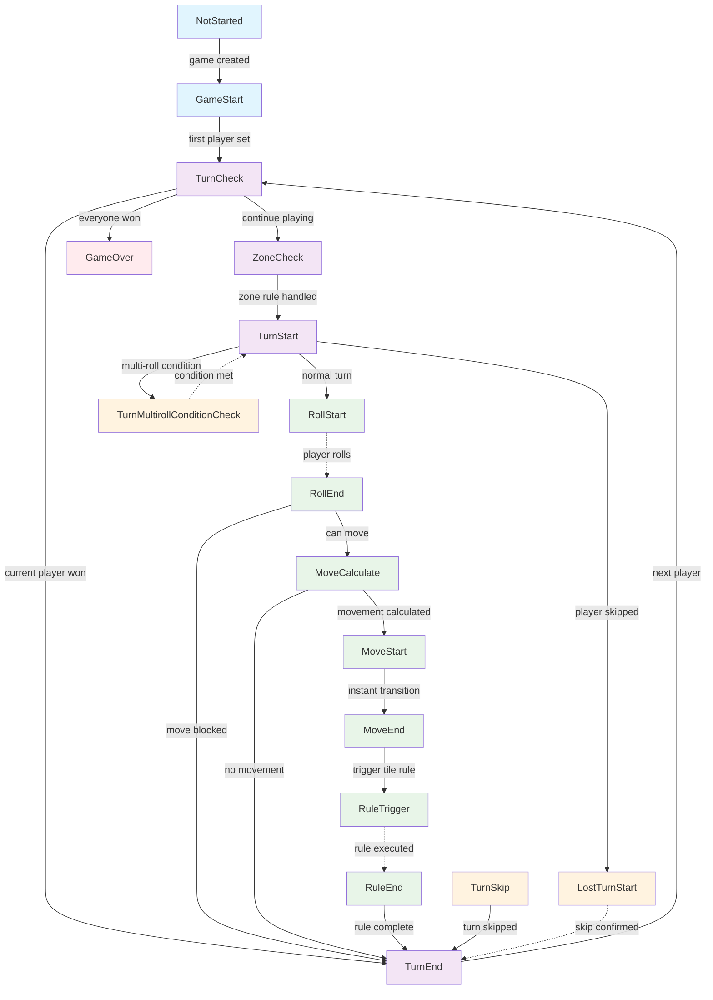

# Technical Overview

Welcome to the Technical Overview of the Drinking Board Game application. This document provides a high-level understanding of the application architecture, key components, and design patterns.

## Repository Structure

This project is organized as a Turborepo monorepo with the following key components:

### Apps

- **`apps/webapp`** - React web application using Vite
- **`apps/cli`** - Command-line interface for the game
- **`apps/cloudfunctions`** - Firebase Cloud Functions
- **`apps/docsite`** - Documentation site using Docusaurus

### Packages

- **`packages/engine`** - Core game engine logic
- **`packages/eslint-config`** - Shared ESLint configurations
- **`packages/i18n`** - Internationalization utilities
- **`packages/react-ui`** - Shared React components
- **`packages/schema`** - Schema for Boards
- **`packages/typescript-config`** - Typescript configuration

### Boards

- **`boards/pokemon-gen1`** - Pokemon gen1 board
- **`boards/pokemon-gen2`** - Pokemon gen2 board
- **`boards/zelda`** - Zelda board
- **`boards/testing-board`** - Testing board

## Architecture Patterns

The architecture follows a clear separation of concerns with distinct layers:

### Three-Layer Architecture

1. **Application Layer**

   - Responsible for presenting game data to users and managing interactions
   - Examples: `apps/webapp`, `apps/cli`
   - Depends on the Data Access Layer and Engine for game logic

2. **Data Access Layer (DAL)**

   - Responsible for responding to requests from the Application layer
   - Executes engine logic and persists game state
   - Example: `apps/cloudfunctions`

3. **Engine Layer**
   - Responsible for executing core game logic without side effects
   - Functions like a pure library with no external dependencies
   - Located in `packages/engine`

### Data Flow Diagram

The following diagram illustrates the typical sequence of events when a user performs an action in the game:



### Anti-Corruption Layers

The project employs **intentionally excessive** anti-corruption layers to maintain clear boundaries between components:

- **Engine Independence**: `packages/engine` has no data storage dependencies and focuses solely on game logic execution
- **UI Abstraction**: `packages/react-ui` defines the structure of UI but not the implementation details
- **Dependency Injection**: Components are designed with interfaces that allow for swappable implementations

## Game Engine Internals

The Engine is the heart of the game logic, organized around several key concepts:

### Core Concepts

- **GameState** - Represents the various stages or phases of the game (e.g., starting the game, rolling dice)
- **Board** - Represents the schema for the game board, defining its structure including tiles, zones, and items
- **Action** - Represents a player-triggered event that modifies game state
- **Rule** - Represents a predefined mechanism to modify game state, encapsulating conditions and consequences
- **Grants** - Mechanism to apply basic effects or modifications to players or game state
- **Context** - Centralized state manager and utility provider for game execution
- **Prompt** - Mechanism to request input or decisions from players during the game

### Action Processing Flow

1. User actions are received by `requestHandler.ts` which serves as the primary entry point for the engine
2. The handler validates the action and routes to the appropriate handler
3. Actions can trigger rule execution, game state changes, or player effects
4. After processing, the new game state is returned along with any animation hints

### Game State Lifecycle

The game follows a state machine pattern with distinct states:

1. **NotStarted** - Initial game setup state before any actions
2. **GameStart** - Initialize game and set first player, execute starting tile rule
3. **StarterSelect** - Reserved state for player order selection (no-op currently)
4. **TurnCheck** - Check if game is over or if current player has won
5. **ZoneCheck** - Check and execute active zone rules before turn starts
6. **TurnStart** - Begin player's turn, check for skipped turns and move conditions
7. **TurnMultirollConditionCheck** - Handle multi-roll conditions for complex challenges
8. **RollStart** - Present dice rolling actions to player (roll, skip, augment)
9. **RollEnd** - Process dice roll result and check move conditions
10. **MoveCalculate** - Calculate movement distance, apply modifiers, check for blockers
11. **MoveStart** - Transition state before movement (immediately goes to MoveEnd)
12. **MoveEnd** - Transition state after movement (immediately goes to RuleTrigger)
13. **RuleTrigger** - Execute the rule of the tile the player landed on
14. **RuleEnd** - Transition state after rule execution (immediately goes to TurnEnd)
15. **TurnEnd** - Advance to next player, handle extra/immediate turns
16. **TurnSkip** - Handle voluntary turn skipping
17. **LostTurnStart** - Handle forced turn skipping due to penalties
18. **GameOver** - End state when all players have won
19. **Battle** - Reserved state for battle mechanics (no-op currently)



## Board Dependency Injection

The Board Registry is a central mechanism for managing game boards:

### Board Registry Pattern

- **`BoardRegistry`** class provides a registry pattern for managing board modules
- Accessible via the exported singleton `boardRegistry` from `packages/engine`
- Core responsibilities:
  - **Registration**: Boards are registered with `boardRegistry.register(boardId, boardModule)`
  - **Retrieval**: Boards can be fetched with `getBoard(boardId)` or `boardRegistry.getBoard(boardId)`
  - **Validation**: Ensures board modules have consistent metadata and required properties

### BoardModule Structure

A `BoardModule` contains:

- **Metadata**: Information about the board (name, id, description)
- **Board Schema**: Definition of tiles, zones, items and rules. This refers directly to the JSON file
- **Extension Info**: Any board-specific logic

### Registration and Resolution Flow

1. **Registration Phase**: Board modules are registered with the `boardRegistry` during initialization
2. **Resolution Phase**: The `BoardHelper` class retrieves the module from the registry and indexes it
3. **Usage Phase**: Engine components access board data through the `BoardHelper`
4. **Benefits**: Decoupling, extensibility, testability, and runtime loading

## UI Architecture

The UI architecture implements a strict anti-corruption layer approach that clearly separates interface definitions from implementations. This section details the key registry patterns that enable this separation.

### Interface vs Implementation Separation

The UI architecture follows a strict separation of concerns:

- **Interface Definition (`packages/react-ui`)**:

  - Defines the structure and behavior of UI components without implementation details
  - Has no dependencies on UI libraries (like Chakra, Material-UI, etc.)
  - Only depends on React itself
  - Provides registry patterns and context interfaces

- **Implementation (`apps/webapp`)**:
  - Implements the interfaces defined by `react-ui`
  - Provides concrete implementations using UI libraries (e.g., Chakra UI)
  - Connects to backend services and manages application state

This separation allows:

1. Swappable UI implementations without changing application logic
2. Clean, well-defined interfaces between UI components
3. Testing with mock implementations
4. Future flexibility to change UI libraries

### UI Component Registry

The UI Component registry is a core pattern that enables the interface/implementation separation:

```tsx
// In react-ui: Define the interface
export interface UIEnvironment {
  Button: FC<{
    variant?: 'primary' | 'secondary' | 'tertiary';
    size?: UISize;
    disabled?: boolean;
    type?: ButtonHTMLAttributes<HTMLButtonElement>['type'];
    children: ReactNode;
    onClick?: () => void;
  }>;
  // ...other component definitions
}

// In webapp: Provide the implementation
const ChakraEnvironmentProvider: FC<{ children: ReactNode }> = ({ children }) => {
  const uiComponents: UIEnvironment = {
    Button: ({ variant, size, disabled, type, children, onClick }) => (
      <ChakraButton
        colorScheme={variant === 'primary' ? 'blue' : 'gray'}
        size={mapSize(size)}
        isDisabled={disabled}
        type={type}
        onClick={onClick}
      >
        {children}
      </ChakraButton>
    ),
    // ...other component implementations
  };

  return (
    <UIEnvironmentContext.Provider value={uiComponents}>{children}</UIEnvironmentContext.Provider>
  );
};
```

Components in `react-ui` access these implementations through the `useUI()` hook:

```tsx
const MyUIComponent = () => {
  const ui = useUI(); // Connects to UIEnvironmentContext
  return <ui.Button>Click me!</ui.Button>;
};
```

This pattern allows `react-ui` to define the structure of UI components without being coupled to any specific UI library implementation.

### Action Registry

The Action Registry manages application-level actions that interact with the backend or modify application state:

```tsx
// In react-ui: Define the interface
export interface AppActions {
  executeGameRequestAction: <T extends keyof Payloads>(
    action: T,
    actionArgs: Payloads[T],
  ) => Promise<void>;
  createAndJoinGame: (board: string, playerNames: string[]) => Promise<void>;
  // ...other actions
}

// In webapp: Provide the implementation
const registerAppActionsImplementation = () => {
  appActionsRegistry.register('executeGameRequestAction', async (action, args) => {
    // Implementation using Firebase or other backend
  });
  // ...register other actions
};
```

Components can use these actions through specific hooks:

```tsx
const GameBoard = () => {
  const executeGameRequest = useExecuteGameRequestAction();

  const rollDice = () => {
    executeGameRequest('rollDice', { playerId: 'player1' });
  };

  return <ui.Button onClick={rollDice}>Roll Dice</ui.Button>;
};
```

The Action Registry uses a generic registry pattern that provides:

- Type-safe action registration and usage
- React hooks for accessing actions
- Automatic component re-rendering when actions change

### Animation Registry

The Animation Registry manages animations triggered by game state changes:

```tsx
// In Engine: Generate animation hints
return {
  game: updatedGameState,
  animationHints: [
    { type: 'playerMove', payload: { playerId: 'player1', fromTile: 5, toTile: 8 } },
  ],
};

// In react-ui: Define animation handler registration
const useAnimationHandler = <T extends AnimationHint>(
  hintType: string,
  handler: (hint: T) => Promise<void>,
  dependencies: any[] = [],
) => {
  const { registerAnimationHandler } = useAnimation();

  useEffect(() => {
    return registerAnimationHandler(hintType, handler as any);
  }, dependencies);
};

// In a component: Register animation handler
useAnimationHandler<PlayerMoveAnimationHint>(
  'playerMove',
  async (hint) => {
    // Implement animation logic
    return new Promise<void>((resolve) => {
      // Animation implementation
      setTimeout(resolve, 500);
    });
  },
  [dependencies],
);
```

This registry allows:

- Decoupled animation logic (Engine generates hints, UI implements animations)
- Multiple components handling the same animation type
- Sequenced animation playback
- Centralized animation state management

### Generic Registry Pattern

All three registries use a shared generic registry implementation that provides:

1. **Typed Interface Definition**: Define expected shape of registry items
2. **Registration Mechanism**: Register implementations of interfaces
3. **React Context Integration**: Provide and consume registry items via React context
4. **Observable Pattern**: Subscribe to changes in registry items
5. **Hook Generation**: Auto-generate type-safe hooks for registry items

This pattern exemplifies the project's commitment to clean separation of concerns while maintaining type safety and ergonomic API design.

## Testing Approach

The project employs several testing methodologies:

### BDD/Cucumber Testing

- The engine handles testing through Behavior-Driven Development using Cucumber
- Feature files describe expected behaviors in natural language
- Step definitions connect those descriptions to actual code tests

### Code Coverage

- Uses c8 for accurate code coverage metrics
- Custom configuration to handle TypeScript transpilation without affecting coverage metrics
