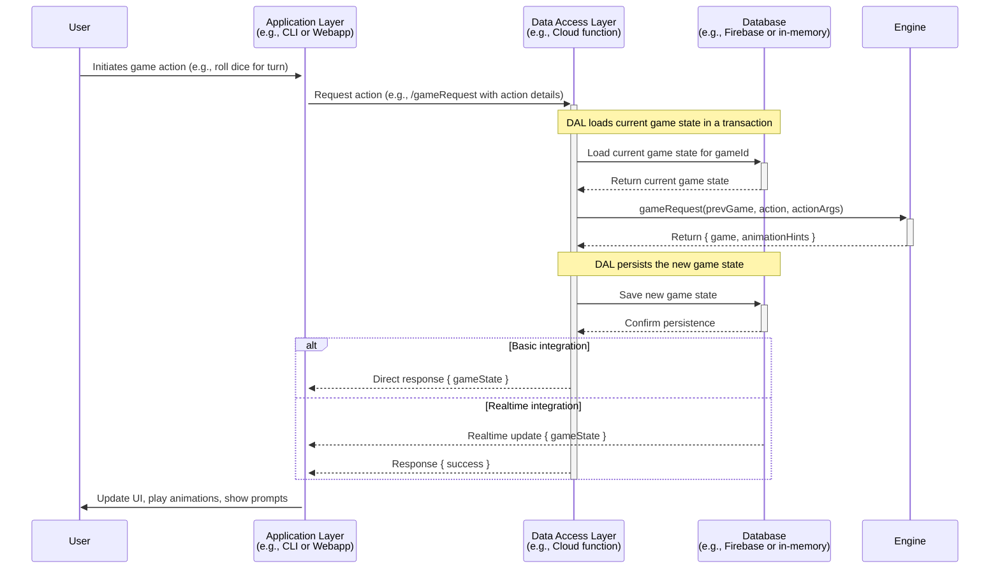

# Technical Overview

Welcome to the Technical Overview of the Drinking Board Game application. This document provides a high-level understanding of the application architecture, key components, and design patterns.

## Repository Structure

This project is organized as a Turborepo monorepo with the following key components:

### Apps

- **`apps/webapp`** - React web application using Vite
- **`apps/cli`** - Command-line interface for the game
- **`apps/cloudfunctions`** - Firebase Cloud Functions
- **`apps/docsite`** - Documentation site using Docusaurus

### Packages

- **`packages/engine`** - Core game engine logic
- **`packages/eslint-config`** - Shared ESLint configurations
- **`packages/i18n`** - Internationalization utilities
- **`packages/react-ui`** - Shared React components
- **`packages/schema`** - Schema for Boards
- **`packages/typescript-config`** - Typescript configuration

### Boards

- **`boards/pokemon-gen1`** - Pokemon gen1 board
- **`boards/pokemon-gen2`** - Pokemon gen2 board
- **`boards/zelda`** - Zelda board
- **`boards/testing-board`** - Testing board

## Architecture Patterns

The architecture follows a clear separation of concerns with distinct layers:

### Three-Layer Architecture

1. **Application Layer**

   - Responsible for presenting game data to users and managing interactions
   - Examples: `apps/webapp`, `apps/cli`
   - Depends on the Data Access Layer and Engine for game logic

2. **Data Access Layer (DAL)**

   - Responsible for responding to requests from the Application layer
   - Executes engine logic and persists game state
   - Example: `apps/cloudfunctions`

3. **Engine Layer**
   - Responsible for executing core game logic without side effects
   - Functions like a pure library with no external dependencies
   - Located in `packages/engine`

### Data Flow Diagram

The following diagram illustrates the typical sequence of events when a user performs an action in the game:



### Anti-Corruption Layers

The project employs **intentionally excessive** anti-corruption layers to maintain clear boundaries between components:

- **Engine Independence**: `packages/engine` has no data storage dependencies and focuses solely on game logic execution
- **UI Abstraction**: `packages/react-ui` defines the structure of UI but not the implementation details
- **Dependency Injection**: Components are designed with interfaces that allow for swappable implementations

## Game Engine Internals

The Engine is the heart of the game logic, organized around several key concepts:

### Core Concepts

- **GameState** - Represents the various stages or phases of the game (e.g., starting the game, rolling dice)
- **Board** - Represents the schema for the game board, defining its structure including tiles, zones, and items
- **Action** - Represents a player-triggered event that modifies game state
- **Rule** - Represents a predefined mechanism to modify game state, encapsulating conditions and consequences
- **Grants** - Mechanism to apply basic effects or modifications to players or game state
- **Context** - Centralized state manager and utility provider for game execution
- **Prompt** - Mechanism to request input or decisions from players during the game

### Action Processing Flow

1. User actions are received by `requestHandler.ts` which serves as the primary entry point for the engine
2. The handler validates the action and routes to the appropriate handler
3. Actions can trigger rule execution, game state changes, or player effects
4. After processing, the new game state is returned along with any animation hints

### Game State Lifecycle

The game follows a state machine pattern with distinct states:

1. **NotStarted** - Initial game setup
2. **TurnStart** - Beginning of a player's turn
3. **RollStart/RollEnd** - Dice rolling phase
4. **MoveStart/MoveEnd** - Player movement phase
5. **RuleTrigger/RuleEnd** - Rule execution phase
6. **TurnEnd** - Completion of a player's turn
7. Additional states for special conditions (Battle, TurnSkip, etc.)

## Board Dependency Injection

The Board Registry is a central mechanism for managing game boards:

### Board Registry Pattern

- **`BoardRegistry`** class provides a registry pattern for managing board modules
- Accessible via the exported singleton `boardRegistry` from `packages/engine`
- Core responsibilities:
  - **Registration**: Boards are registered with `boardRegistry.register(boardId, boardModule)`
  - **Retrieval**: Boards can be fetched with `getBoard(boardId)` or `boardRegistry.getBoard(boardId)`
  - **Validation**: Ensures board modules have consistent metadata and required properties

### BoardModule Structure

A [`BoardModule`](/docs/schema/interfaces/BoardModule) contains:

- **Metadata**: Information about the board (name, id, description)
- **Board Schema**: Definition of tiles, zones, items and rules. This refers directly to the JSON file
- **Extension Info**: Any board-specific logic

### Registration and Resolution Flow

1. **Registration Phase**: Board modules are registered with the `boardRegistry` during initialization
2. **Resolution Phase**: The `BoardHelper` class retrieves the module from the registry and indexes it
3. **Usage Phase**: Engine components access board data through the `BoardHelper`
4. **Benefits**: Decoupling, extensibility, testability, and runtime loading

## UI Components Pattern

The UI layer follows a provider pattern for component abstraction:

### UI Environment Context

- `UIEnvironmentContext` defines behaviors of UI components without implementation details
- `react-ui` defines the structure of UI but not specific implementations
- Application layers (like webapp) provide concrete implementations using UI libraries

Example usage:

```tsx
const MyUIComponent = () => {
  const ui = useUI(); // Connects to UIEnvironmentContext
  return <ui.Button>Click me!</ui.Button>;
};
```

## Animation System

The webapp implements a robust animation system for smooth visual transitions:

### Animation Context System

- **`AnimationProvider`** in `packages/react-ui/src/context/AnimationContext.tsx` acts as the central registry
- Exposes methods for registering handlers and playing animations
- Tracks the global animation state through `isAnimating`

### Animation Hints

- Animations are driven by `AnimationHint` objects generated by the Engine
- Each hint has a `type` (e.g., 'playerMove', 'turnRoll') and a `payload` with animation data
- Hints are collected in the Context's `animationHints` array and played sequentially

### Registration Pattern

Components register as animation handlers via the `useAnimationHandler` hook:

```typescript
useAnimationHandler<PlayerMoveAnimationHint>(
  'playerMove',
  async (hint) => {
    // Animation implementation
    return new Promise<void>((resolve) => {
      // Resolve when animation completes
    });
  },
  [dependencies],
);
```

## Testing Approach

The project employs several testing methodologies:

### BDD/Cucumber Testing

- The engine handles testing through Behavior-Driven Development using Cucumber
- Feature files describe expected behaviors in natural language
- Step definitions connect those descriptions to actual code tests

### Code Coverage

- Uses c8 for accurate code coverage metrics
- Custom configuration to handle TypeScript transpilation without affecting coverage metrics

## Adding New Game Actions

1. Define action type in `packages/enums`
2. Create action handler in `packages/engine/src/actions`
3. Register handler in action handler factory map
4. Implement client-side handling in webapp/cli

## Best Practices

1. Use TypeScript strictly
2. Follow ESLint configurations
3. Keep components focused and composable
4. Use proper error handling patterns
5. Document complex logic
6. Follow existing file organization patterns
