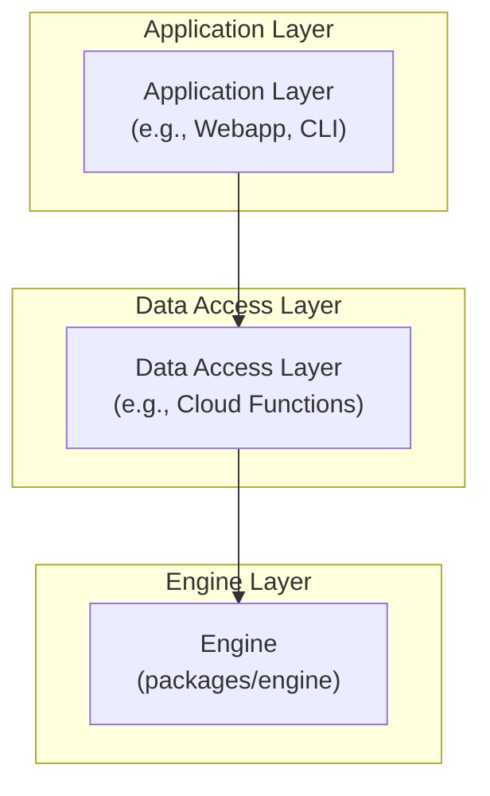

# Technical Overview

Welcome to the Technical Overview of the Engine package. This section provides a high-level summary and direct links into the generated API documentation.

## Engine Documentation Index

- [Engine README](./engine/README.md)
- [Engine Modules](./engine/modules.md)

## API Reference Sections

- [Actions](./engine/actions/README.md)
- [Boards](./engine/boards/README.md)
- [Context](./engine/context/README.md)
- [Gamestate](./engine/gamestate/README.md)
- [Index](./engine/index/README.md)
- [Rules](./engine/rules/README.md)

Explore each section for detailed API documentation and usage examples.

## Data Flow Diagram

The following diagram illustrates the high-level data flow between the major components of the application:

